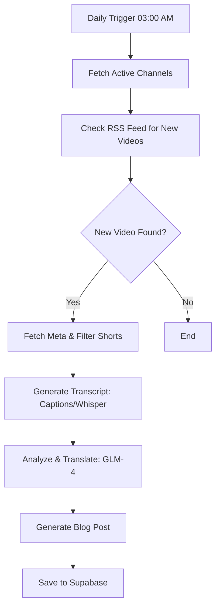

# YouTube to Blog

<p align="center">
  
  
  
  
</p>

A powerful automated system that monitors YouTube channels, transcribes videos, translates content, and generates multilingual blog posts using AI. Deeply integrated with macOS for local high-performance transcription.


## 📖 Table of Contents

- [✨ Features](#-features)
- [🚀 Tech Stack](#-tech-stack)
- [🛠 Prerequisites](#-prerequisites)
- [📦 Installation](#-installation)
- [🔐 Environment Variables](#-environment-variables)
- [⏰ Scheduled Task Setup](#-scheduled-task-setup-macos)
- [🔧 Manual Usage](#-manual-usage)
- [📊 Processing Workflow](#-processing-workflow)
- [📂 Project Structure](#-project-structure)
- [📜 License](#-license)

---

## ✨ Features

- **📺 Automated Channel Monitoring**: Daily RSS-based checks for new content with zero API quota consumption.
- **🎙️ Local AI Transcription**: High-accuracy transcription using **OpenAI Whisper** running locally on your hardware.
- **🧠 Advanced AI Writing**: High-quality translation and blog post generation powered by **GLM-4 (Zhipu AI)**.
- **🌍 Multilingual Engine**: Seamlessly generate content in multiple target languages.
- **🖥️ Clean UI**: Modern Next.js dashboard for managing channels and reviewing articles.
- **⚙️ macOS Native**: Fully optimized background processing using `launchd`.

---

## 🚀 Tech Stack

### Backend (Processing Engine)
- **Language**: Python 3.12+
- **Manager**: `uv` (Blazing fast package management)
- **Transcription**: OpenAI Whisper (Local)
- **AI LLM**: GLM-4 (API)
- **Metadata**: YouTube Data API v3 & RSS

### Frontend (User Interface)
- **Framework**: Next.js 14 (App Router)
- **Styling**: Tailwind CSS & Shadcn UI
- **Deployment**: Optimized for Vercel or local hosting

### Infrastructure
- **Database**: Supabase (PostgreSQL)
- **Authentication**: Supabase Auth
- **Automation**: macOS `launchd`

---

## 🛠 Prerequisites

- **macOS** (Apple Silicon recommended for optimal Whisper performance)
- **ffmpeg** (Essential for audio extraction)
- **Python 3.12+** & [uv](https://github.com/astral-sh/uv)
- **Node.js 18+** & **pnpm/npm**
- **Supabase Account**

---

## 📦 Installation

### 1. Clone & Configure
```bash
git clone https://github.com/yourusername/youtube-to-blog.git
cd youtube-to-blog
```

### 2. Backend Setup
```bash
cd backend
uv sync  # Installs all Python dependencies
```

### 3. Database Initialization
1. Create a project on [Supabase](https://supabase.com).
2. Run the SQL script from `supabase/migrations/001_initial_schema.sql` in the Supabase SQL Editor.

### 4. Frontend Setup
```bash
cd ../frontend
pnpm install
pnpm dev
```

---

## 🔐 Environment Variables

Detailed configuration is required for both components.

### 🔑 Getting API Keys
- **Supabase**: Settings → API (URL & Service Role Key)
- **YouTube API**: [Google Cloud Console](https://console.cloud.google.com/) (Enable YouTube Data API v3)
- **GLM (Zhipu AI)**: [BigModel Open Platform](https://open.bigmodel.cn/)

### Configuration
#### Backend (`backend/.env`)
```env
SUPABASE_URL=https://your-project.supabase.co
SUPABASE_SERVICE_ROLE_KEY=your-key
YOUTUBE_API_KEY=your-key
GLM_API_KEY=your-key
```

#### Frontend (`frontend/.env.local`)
```env
NEXT_PUBLIC_SUPABASE_URL=https://your-project.supabase.co
NEXT_PUBLIC_SUPABASE_ANON_KEY=your-key
YOUTUBE_API_KEY=your-key
NEXT_PUBLIC_ADMIN_EMAILS=your@email.com
```

---

## ⏰ Scheduled Task Setup (macOS)

The system automates processing using `launchd`.

### 1. Initialize Configuration
```bash
cp backend/run_cron.sh.example backend/run_cron.sh
cp backend/com.youtube2blog.processor.plist.example backend/com.youtube2blog.processor.plist
```

### 2. Auto-Update Paths
```bash
sed -i '' "s|\[\[PROJECT_PATH\]\]|$(pwd)|g" backend/run_cron.sh backend/com.youtube2blog.processor.plist
sed -i '' "s|\[\[USER_HOME\]\]|${HOME}|g" backend/run_cron.sh
```

### 3. Register Service
```bash
chmod +x backend/run_cron.sh
mkdir -p backend/logs
cp backend/com.youtube2blog.processor.plist ~/Library/LaunchAgents/
launchctl load ~/Library/LaunchAgents/com.youtube2blog.processor.plist
```

---

## 🔧 Manual Usage

```bash
cd backend
# Run full pipeline
uv run src/main.py

# Debug specific content
uv run src/main.py --video-id [VIDEO_ID]
```

---

## 📊 Processing Workflow



---

## 📂 Project Structure

```text
.
├── backend/            # Python core engine
│   ├── src/            # Intelligence & processing logic
│   ├── tests/          # Test suite
│   └── logs/           # Automation logs
├── frontend/           # Next.js 14 Dashboard
│   ├── app/            # App router pages
│   ├── components/     # UI components
│   └── lib/            # Utilities & Supabase client
├── supabase/           # Database schema & migrations
└── README.md           # This file
```

---

## 📜 License

This project is licensed under the MIT License - see the [LICENSE](LICENSE) file for details.

---

PRD written with **CLAUDE AI**, Code implemented with **GLM-4.7** & **Gemini 3.0 Pro**.
